# Plano de Execução

**Estágio**: INCEPTION — Workflow Planning
**Data**: 2026-08-08
**Projeto**: Controle Orçamentário Pessoal (greenfield)

---

## 1. Resumo da Análise Detalhada

### 1.1 Avaliação de Impacto

| Área | Impacto | Descrição |
|---|---|---|
| **Mudanças voltadas ao usuário** | Sim | Produto inteiro voltado ao usuário final: 5 telas, fluxo de pagamento em dois toques, projeção visual |
| **Mudanças estruturais** | Sim | Arquitetura definida do zero: motor puro, camada de repositório, casca de aplicação |
| **Modelo de dados** | Sim | Schema completo novo: regras, parcelamentos, cartões, ocorrências, âncora de saldo |
| **Mudanças de API** | Não | Não há API. As fronteiras internas são interfaces TypeScript entre módulos |
| **Impacto em NFR** | Sim | Corretude monetária e de calendário, operação offline, acessibilidade, CSP, cadeia de suprimentos |

### 1.2 Camadas afetadas

**Camada de aplicação**
- Código: projeto inteiro, criado do zero
- Dependências: React, TypeScript, Vite, Dexie, `vite-plugin-pwa`, Vitest, fast-check, Testing Library, fake-indexeddb
- Configuração: manifesto do PWA, service worker, CSP via `<meta http-equiv>`, `base` do Vite para GitHub Pages
- Testes: por exemplo e por propriedade, conforme extensão PBT habilitada

**Camada de infraestrutura**
- Sem nuvem, sem rede, sem contêiner, sem banco gerenciado
- Publicação estática em GitHub Pages via HTTPS
- Restrição relevante: GitHub Pages não permite cabeçalhos HTTP customizados

**Camada de operações**
- Sem monitoramento, log centralizado ou alertas — o app roda inteiramente no dispositivo do usuário
- Recuperação de desastre pelo backup manual (RF-28 a RF-31)

### 1.3 Avaliação de Risco

| Dimensão | Nível | Justificativa |
|---|---|---|
| **Risco geral** | **Baixo** | Uso individual, sem dados de terceiros, sem exposição em rede, sem sistema legado a preservar |
| **Complexidade de rollback** | Fácil | Publicação estática; reverter é republicar a versão anterior. Os dados do usuário são protegidos por migrações versionadas e backup |
| **Complexidade de teste** | Moderada | O motor puro é altamente testável, mas a aritmética de calendário e monetária concentra os casos de borda que exigem cuidado |

**Riscos específicos identificados**

| Risco | Mitigação |
|---|---|
| Perda de dados locais (troca de aparelho, limpeza do Safari, recuperação de espaço) | Backup como funcionalidade de primeira classe, aviso após 14 dias sem exportar, `navigator.storage.persist()` quando disponível |
| Bug silencioso de fuso horário deslocando datas em um dia | RNF-09 proíbe conversões por `Date` em UTC; PBT cobre ida e volta de data |
| Centavos fantasma por ponto flutuante | RNF-08 exige inteiros em centavos; PBT verifica ausência de fração |
| Dupla contagem de parcela de cartão dentro da fatura | RF-10 e RF-12: parcela de cartão não gera saída própria e o valor real substitui a estimativa |
| Migração de schema quebrando dados existentes | RNF-05 exige migrações versionadas, com teste de migração exercitada |
| CSP não aplicável por cabeçalho no GitHub Pages | Tratado no Infrastructure Design: CSP por `<meta http-equiv>`, limitação documentada |

---

## 2. Unidades de Trabalho

Três unidades, com dependência estritamente sequencial.

### Unidade 1 — Núcleo de Domínio e Motor de Projeção

**Responsabilidade**: toda a lógica de negócio, como funções puras. Sem banco, sem interface, sem relógio implícito.

**Conteúdo**: tipos do domínio; aritmética monetária em centavos; aritmética de calendário local; expansão de regras, parcelamentos e cartões em ocorrências virtuais; resolução de sobreposição; cálculo da curva diária; estimativa de fatura; vigência de regras.

**Depende de**: nada.
**Requisitos cobertos**: RF-02, RF-08, RF-11, RF-19, RF-20, RF-22, RF-23, RF-26; RNF-08 a RNF-11, RNF-27, RNF-29.

### Unidade 2 — Persistência e Backup

**Responsabilidade**: guardar e recuperar o estado, e o ciclo de exportação e importação.

**Conteúdo**: schema Dexie com versionamento e migrações; repositórios por entidade; serialização de backup com versão de schema; validação de importação antes de qualquer escrita; substituição integral do estado; contagem de dias desde a última exportação.

**Depende de**: Unidade 1 (tipos do domínio).
**Requisitos cobertos**: RF-28 a RF-31; RNF-05 a RNF-07, RNF-24, RNF-25.

### Unidade 3 — Aplicação e Interface

**Responsabilidade**: as cinco telas, a casca do PWA e a publicação.

**Conteúdo**: casca do PWA (manifesto, service worker, ícones, safe area); navegação por barra inferior; tela do mês com resumo, curva e listas; folha de pagamento em dois toques; telas de cadastro com o fluxo de vigência; tela de 12 meses; ajustes com âncora e backup; tema seguindo o iOS; acessibilidade básica; configuração de publicação no GitHub Pages.

**Depende de**: Unidades 1 e 2.
**Requisitos cobertos**: RF-01, RF-03 a RF-07, RF-09, RF-10, RF-12 a RF-18, RF-21, RF-24, RF-25, RF-27; RNF-01 a RNF-04, RNF-14 a RNF-23, RNF-26.

### Sequência

```
Unidade 1  ->  Unidade 2  ->  Unidade 3
(dominio)      (persistencia)  (aplicacao)
```

Sem paralelização: cada unidade consome os tipos e as funções da anterior.

---

## 3. Visualização do Fluxo

```mermaid
flowchart TD
    Start(["Pedido do Usuario"])

    subgraph INCEPTION["INCEPTION PHASE"]
        WD["Workspace Detection<br/><b>COMPLETED</b>"]
        RE["Reverse Engineering<br/><b>SKIP</b>"]
        RA["Requirements Analysis<br/><b>COMPLETED</b>"]
        US["User Stories<br/><b>SKIP</b>"]
        WP["Workflow Planning<br/><b>IN PROGRESS</b>"]
        AD["Application Design<br/><b>EXECUTE</b>"]
        UG["Units Generation<br/><b>EXECUTE</b>"]
    end

    subgraph CONSTRUCTION["CONSTRUCTION PHASE"]
        FD["Functional Design<br/>por unidade<br/><b>EXECUTE</b>"]
        NFRA["NFR Requirements<br/>por unidade<br/><b>EXECUTE</b>"]
        NFRD["NFR Design<br/>por unidade<br/><b>EXECUTE</b>"]
        ID["Infrastructure Design<br/>somente Unidade 3<br/><b>EXECUTE</b>"]
        CG["Code Generation<br/>por unidade<br/><b>EXECUTE</b>"]
        BT["Build and Test<br/><b>EXECUTE</b>"]
    end

    subgraph OPERATIONS["OPERATIONS PHASE"]
        OPS["Operations<br/><b>PLACEHOLDER</b>"]
    end

    Start --> WD
    WD --> RE
    RE --> RA
    RA --> US
    US --> WP
    WP --> AD
    AD --> UG
    UG --> FD
    FD --> NFRA
    NFRA --> NFRD
    NFRD --> ID
    ID --> CG
    CG --> BT
    BT --> OPS
    OPS --> End(["Completo"])

    style WD fill:#4CAF50,stroke:#1B5E20,stroke-width:3px,color:#fff
    style RA fill:#4CAF50,stroke:#1B5E20,stroke-width:3px,color:#fff
    style WP fill:#4CAF50,stroke:#1B5E20,stroke-width:3px,color:#fff
    style CG fill:#4CAF50,stroke:#1B5E20,stroke-width:3px,color:#fff
    style BT fill:#4CAF50,stroke:#1B5E20,stroke-width:3px,color:#fff
    style RE fill:#BDBDBD,stroke:#424242,stroke-width:2px,stroke-dasharray: 5 5,color:#000
    style US fill:#BDBDBD,stroke:#424242,stroke-width:2px,stroke-dasharray: 5 5,color:#000
    style AD fill:#FFA726,stroke:#E65100,stroke-width:3px,stroke-dasharray: 5 5,color:#000
    style UG fill:#FFA726,stroke:#E65100,stroke-width:3px,stroke-dasharray: 5 5,color:#000
    style FD fill:#FFA726,stroke:#E65100,stroke-width:3px,stroke-dasharray: 5 5,color:#000
    style NFRA fill:#FFA726,stroke:#E65100,stroke-width:3px,stroke-dasharray: 5 5,color:#000
    style NFRD fill:#FFA726,stroke:#E65100,stroke-width:3px,stroke-dasharray: 5 5,color:#000
    style ID fill:#FFA726,stroke:#E65100,stroke-width:3px,stroke-dasharray: 5 5,color:#000
    style OPS fill:#BDBDBD,stroke:#424242,stroke-width:2px,stroke-dasharray: 5 5,color:#000
    style INCEPTION fill:#BBDEFB,stroke:#1565C0,stroke-width:3px,color:#000
    style CONSTRUCTION fill:#C8E6C9,stroke:#2E7D32,stroke-width:3px,color:#000
    style OPERATIONS fill:#FFF59D,stroke:#F57F17,stroke-width:3px,color:#000
    style Start fill:#CE93D8,stroke:#6A1B9A,stroke-width:3px,color:#000
    style End fill:#CE93D8,stroke:#6A1B9A,stroke-width:3px,color:#000

    linkStyle default stroke:#333,stroke-width:2px
```



### Alternativa Textual

```
INCEPTION
  Workspace Detection ..................... COMPLETED
  Reverse Engineering ..................... SKIP (greenfield)
  Requirements Analysis ................... COMPLETED
  User Stories ............................ SKIP (decisao do usuario)
  Workflow Planning ....................... EM ANDAMENTO
  Application Design ...................... EXECUTE
  Units Generation ........................ EXECUTE

CONSTRUCTION (por unidade: 1 dominio, 2 persistencia, 3 aplicacao)
  Functional Design ....................... EXECUTE (unidades 1, 2, 3)
  NFR Requirements ........................ EXECUTE (unidade 1); SKIP (2, 3)
  NFR Design .............................. EXECUTE (unidades 1, 3); SKIP (2)
  Infrastructure Design ................... EXECUTE (unidade 3); SKIP (1, 2)
  Code Generation ......................... EXECUTE (unidades 1, 2, 3)
  Build and Test .......................... EXECUTE (apos todas as unidades)

OPERATIONS
  Operations .............................. PLACEHOLDER
```

---

## 4. Estágios a Executar e a Pular

### 🔵 INCEPTION PHASE

- [x] **Workspace Detection** — CONCLUÍDO
- [x] **Reverse Engineering** — PULADO
  - *Justificativa*: projeto greenfield, sem código a analisar
- [x] **Requirements Analysis** — CONCLUÍDO
- [x] **User Stories** — PULADO
  - *Justificativa*: decisão explícita do usuário. Os fluxos já estão detalhados no design aprovado e os critérios de aceite estão cobertos pelos 31 requisitos funcionais e pelos 5 critérios de sucesso
- [x] **Workflow Planning** — EM ANDAMENTO
- [ ] **Application Design** — **EXECUTAR**
  - *Justificativa*: projeto novo sem nenhum componente existente. As fronteiras entre motor puro, repositório e interface são a decisão que sustenta a testabilidade de todo o resto e precisam ser definidas explicitamente
- [ ] **Units Generation** — **EXECUTAR**
  - *Justificativa*: o sistema se decompõe naturalmente em três unidades com dependência sequencial clara. Formalizar a decomposição permite completar e validar cada unidade antes de iniciar a seguinte

### 🟢 CONSTRUCTION PHASE

- [ ] **Functional Design** — **EXECUTAR** nas três unidades
  - *Justificativa*: há modelo de dados novo e lógica de negócio não trivial (recorrência, sobreposição, calendário). Além disso, a regra **PBT-01** exige que as propriedades testáveis sejam identificadas justamente neste estágio — pular tornaria a extensão habilitada inaplicável
- [ ] **NFR Requirements** — **EXECUTAR** na Unidade 1; **PULAR** nas Unidades 2 e 3
  - *Justificativa*: a stack e o framework de PBT (**PBT-09**) são decididos uma vez, na primeira unidade. As unidades seguintes herdam essas decisões sem NFR próprio
- [ ] **NFR Design** — **EXECUTAR** nas Unidades 1 e 3; **PULAR** na Unidade 2
  - *Justificativa*: a Unidade 1 concentra os padrões de corretude monetária e de calendário; a Unidade 3 concentra offline, acessibilidade e CSP. A Unidade 2 não introduz NFR além dos já definidos
- [ ] **Infrastructure Design** — **EXECUTAR** na Unidade 3; **PULAR** nas Unidades 1 e 2
  - *Justificativa*: a única infraestrutura existente é a publicação estática. Concentrar na Unidade 3 evita repetir o mesmo conteúdo três vezes. Este estágio deve resolver a limitação de cabeçalhos HTTP do GitHub Pages, apontada na avaliação de SECURITY-04
- [ ] **Code Generation** — **EXECUTAR** nas três unidades (sempre)
- [ ] **Build and Test** — **EXECUTAR** (sempre), após todas as unidades

### 🟡 OPERATIONS PHASE

- [ ] **Operations** — PLACEHOLDER
  - *Justificativa*: estágio ainda não implementado no AI-DLC. Não há operação a executar: o app roda no dispositivo do usuário, sem infraestrutura para monitorar

---

## 5. Cronograma

| Item | Valor |
|---|---|
| **Estágios restantes** | 2 na Inception, 14 execuções de estágio na Construction (por unidade), mais Build and Test |
| **Pontos de aprovação** | 1 por estágio executado — o usuário aprova antes de cada avanço |

Não há estimativa em horas: o ritmo é determinado pelas revisões e aprovações do usuário, não por esforço de máquina.

---

## 6. Critérios de Sucesso

**Objetivo principal**: entregar um PWA instalável no iPhone que responda, sem lançamento manual repetitivo, se o mês fecha no azul e em qual dia o saldo chega ao mínimo.

**Entregáveis**
1. Código-fonte na raiz do workspace, seguindo a stack aprovada
2. Motor de projeção puro, com testes por exemplo e por propriedade
3. Camada de persistência com migrações versionadas e testes com `fake-indexeddb`
4. Cinco telas funcionais, instaláveis como PWA no iOS
5. Exportação e importação de backup com validação
6. Instruções de build, teste e publicação

**Portões de qualidade**
1. Todos os testes passando, com semente registrada nas execuções de PBT (PBT-08)
2. Nenhum achado bloqueante de segurança em aberto nas regras aplicáveis (SECURITY-04, -09, -10, -13, -15)
3. Conformidade PBT verificada em cada estágio aplicável
4. Os 5 critérios de sucesso da seção 6 de `requirements.md` verificados
5. Arquivo de lock versionado e varredura de vulnerabilidades configurada (SECURITY-10)

---

## 7. Conformidade com Extensões neste Estágio

### Segurança

| Regra | Situação | Observação |
|---|---|---|
| SECURITY-04 | Encaminhada | Resolução atribuída ao Infrastructure Design da Unidade 3; a limitação do GitHub Pages está registrada como restrição conhecida |
| SECURITY-09, -10, -13, -15 | Encaminhadas | Atribuídas aos estágios de NFR Design e Code Generation |
| Demais regras | N/A | Conforme avaliado em `requirements.md`, seção 7.1 |

**Achados bloqueantes**: nenhum. Nenhuma regra aplicável está sem responsável definido no plano.

### Testes por Propriedades

| Regra | Situação | Observação |
|---|---|---|
| PBT-01 | Encaminhada | Functional Design está marcado EXECUTE nas três unidades, atendendo à exigência da regra |
| PBT-09 | Encaminhada | NFR Requirements da Unidade 1 |
| PBT-02 a PBT-08, PBT-10 | Encaminhadas | Code Generation e Build and Test |

**Achados bloqueantes**: nenhum.
